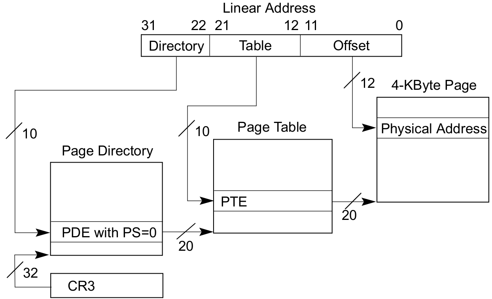

# 7.3 Virtual Memory

Our goal for this part is just to enable paging. That is switching on the
related CPU functionality. Not more. We will exploit that mechanism later when
we implement processes. Let's dive in.

## Address translation

> Many platforms, including x86, use a memory management unit (MMU) to handle
> translation between the virtual and physical address spaces. [^osdev]

The MMU sits between the CPU and the memory. It includes a **TLB** (Translation
Lookaside Buffer) which caches page lookups.

> For simplicity, our paging system will only support **pages** of size 4KiB,
> and the physical memory is divided into **frames** of size
> 4KiB. [^hux-kernel]

On x86 the translation from virtual to physical addresses is done via:

- a special register, CR3 aka Page Directory Base Register (PDBR), which stores
  the physical address of the Page Directory
- a special data structure, the **Page Directory**, a table of 1024 32-bit
  entries (for 4K pages) pointing to Page Tables
- other very similar data structures, **Page Tables**, tables of 1024 32-bit
  entries (for 4K pages) pointing to actual physical frames.

Just clarifying sizes:

- page directory: 4 KB (1024 entries)
- each page table: 4 KB (also 1024 entries)
- maximum total: 1024 PDEs + 1024*1024 PTEs = 4 KB + 4 MB.

2 important notes on the translation:

1. Translation is a 2-level lookup using the virtual address as follows:
   ```
   32-bit VADDR := |31  PDE Index  22|21  PTE Index  12|11  Offset In Page  0|
   ```
2. Page Directory and Page Table *entries* are 32-bit and can be considered as
   physical addresses to Page Tables or frames respectively, except that only
   the 20 most significant bits are used (as least significant bits are used as
   flags). Meaning that addresses must be (4K) page-aligned.

<figure>

<figcaption>Page translation process.</figcaption>
</figure>

Note how easily we can change the whole memory context! For example for
different processes. That said when modifying translation tables, we need to
remove obsolete entries from the TLB. This can be done by either:

- Issuing the `invlpg` instruction to invalidate a page
- Reloading the `CR3` register to simulate a complete address space switch

## Setup paging

Paging is actually enabled by setting bit 31 of CR0. As soon as paging is
enabled, all addresses (used in code thus by the CPU) become virtual, and all
of our memory references go through the MMU first!

> Our goal after setting up paging is to have the kernel’s virtual address
> space **identity-mapped** to the beginning of the physical memory and reserve
> some fixed amount of memory for the kernel heap. The rest of the physical
> memory will be free frames for mapping user process pages. [^hux-kernel]

> Identity Mapping is nothing more than mapping a virtual address to the same
> physical address. For example, virtual address 0x100000 is mapped to physical
> address 0x100000. Yep--Thats all there is to it. The only real time this is
> required is when first setting up paging. It helps insure the memory
> addresses of your current running code of where they are at stays the same
> when paging is enabled. Not doing this will result in immediate triple
> fault. You will see an example of this in our Virtual Memory Manager
> initialization routine. [^brokenthorn]

Identity-mapping the kernel is convenient as we enable pagination: the physical
addresses before are mapped to linear addresses afterwards.

Identity-mapping the kernel makes address translation for the kernel heap much
faster. [FIXME Really? Why?]

Quick question: if physical address space is 2^32 = 4 GiB, and paging deals
with a virtual space of 1024 (page directory entries) * 1024 (page table
entries = frames) * 4096 (page size) = 4 GiB, **how precisely does paging
provide a wider virtual address space**? Well for one *each process* can
virtually access 4 GiB. Also the address space can be extended to disk pages,
aka **swapping**.

It's worth noting that each process will get the kernel mapped to its virtual
memory space:

> How can we allow multiple programs a 4GB address space if we can only have
> one page directory at a time?  We cant. Not nativly, anyways. Alot of
> mutitasking operating systems map the high 2 GB address space for its own use
> as "kernel space" and the low 2 GB as "user space". The user space cannot
> touch kernel space. With the kernel address space being mapped to every
> processes 4GB virtual address space, we can simply switch the current page
> directory without error using the kernel no matter what process is currently
> running. This is possible due to the kernel always being located at the same
> place in the processes address space. This also makes scheduling
> possible. [^brokenthorn]

Hobby OSes, including linux-0.01 and xv6, map all physical memory for
simplicity. Xv6 is a bit more precise as it maps more specific chunks from
lower memory (I/O and kernel spaces). Xv6 also [arbitrarily limits the physical
memory](https://stackoverflow.com/a/29892921) (`PHYSTOP`) to 224MB. And yes,
the dot-bochsrc provided with xv6 is inconsistent because its specifies the
a physical memory of 32MB (the default).

### Paging schemes

More specifically, for our kernel to access physical memory after enabling
paging, it needs to access page table frames. We thus need to map some virtual
pages to them. The simplest solution is to identity map all page tables.

But, as outlined on OSdev[^osdev-paging], on their forum, or in blog_os
implementation discussions[^blogos-discuss], there are multiple approaches to
how much physical memory or what parts of it should be mapped:

- map the complete physical memory.
- only map page table frames, i.e. the pages/frames which will enable the
  kernel to access physical memory.

There is no definitive answer. Mapping only page tables allows for more
flexibility at the cost of complexity[^osdev-paging]. When considering
performance, mapping all memory probably loses, since it takes up more space to
store all page tables, and time to initialize. For example, if the memory size
is huge, as on x86_64, there might be little benefit avoiding mapping all
physical memory since we can still use plenty other space for other
purposes[^blogos-discuss].

That is for the *what*. For the *how*, we can decide to either:

- identity map: virtual addresses are translated to the same value as the
  corresponding physical addresses.
- map at a fixed offset: virtual addresses start at a fixed value which points
  to a lower physical address, like 0x0. This is what higher half kernel
  use. More on this later.

We can theoretically combine approaches. See [blog_os post about paging
implementation](https://os.phil-opp.com/paging-implementation/) for a more
detailed explanation of each approach.

Note paging (memory mapping) and physical memory management (frame allocation)
are two orthogonal concepts. One enables the kernel to access physical memory,
the other deals with tracking the usage of the physical memory. For example,
hux-kernel [identity-maps all physical
memory](https://github.com/josehu07/hux-kernel/blob/d9e210f3f90b030dc2cf2df6a19484c78c50fed1/src/memory/paging.c#L435)
and creates multiple allocator spaces.
[Xv6](https://github.com/mit-pdos/xv6-public/blob/eeb7b415dbcb12cc362d0783e41c3d1f44066b17/vm.c#L69)
maps all physical memory to a fixed offset and creates a single frame allocator
from the end of the kernel to the end of the physical memory.  Paging and
physical memory management do intersect early, when creating the mapping: the
kernel needs to allocate a frame for each PTE.

### Recursive paging

For completeness, I would like to mention **recursive page table mapping**.

What that enables is avoiding mapping the whole physical memory.

The principle is simply that the last PDE points to the physical page
directory. By doing so, we can engineer virtual addresses to access basically
all page tables. This works because tables of all levels have the exact same
layout on x86 and x86\_64. Good explanations can be found on
[blog_os](https://os.phil-opp.com/paging-implementation/#recursive-page-tables)
or [osdev](https://wiki.osdev.org/User:Neon/Recursive_Paging).

## Implementation

All this is just for reference as we will just focus on enabling paging for
now: we will follow hux-kernel and identity map all memory.

We will come back to implementation details and look at mapping examples in the
[Process Creation](./8.1.Process_Creation.md) chapter.


## References

- [^sos]: [sos](sos.enix.org/)
- [^hux-kernel]: [hux-kernel](https://github.com/josehu07/hux-kernel)
- [^brokenthorn]: [brokenthorn](http://www.brokenthorn.com/Resources/OSDev18.html)
- [^littleos]: [littleos](https://littleosbook.github.io/#reasons-to-not-identity-map-the-kernel)
- [^osdev-paging]: [OSDev](https://wiki.osdev.org/Brendan%27s_Memory_Management_Guide#Virtual_Memory_Management)
- [^blogos-discuss]: [blogos-discuss](https://github.com/phil-opp/blog_os/issues/545)
