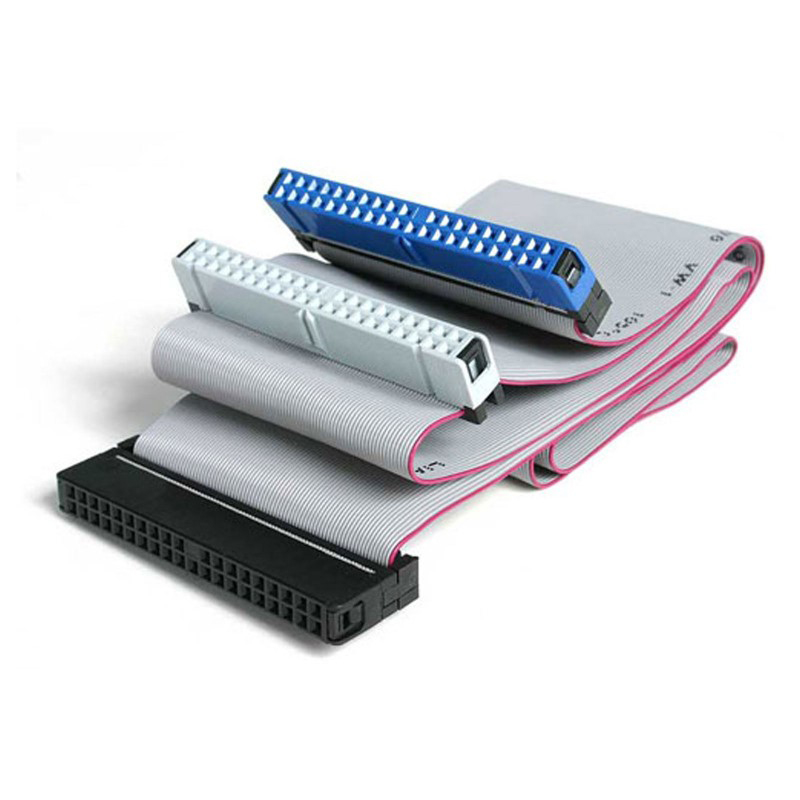
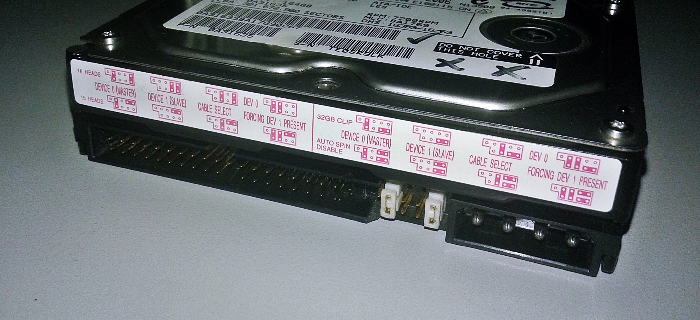

# 9.1 IDE Driver

**Note**: this iteration is captured in the git tag `ide`.

## History

A bit of historical context and terminology first.

Parallel *ATA* (PATA), originally *AT Attachment*, aka *IDE* for *Integrated
Drive Electronics*, is a standard interface for PC-compatible hard drives and
CD or DVD drives. AT refers to the IBM PC/AT (Advanced Technology) model.

> The term *Integrated Drive Electronics* refers to the fact that the drive
> controller is integrated into the drive, as opposed to a separate controller
> situated at the other side of the connection cable to the drive. On an IBM PC
> compatible, CP/M machine, or similar, this was typically a card installed on
> a motherboard.
>
> After the introduction of SATA in 2003, the original ATA was renamed to
> Parallel ATA, or PATA for short. [^w-pata]

In summary: **ATA = PATA = IDE**.

ATA was the predominant storage interface on PCs from the late 1980's to the
early 2000's.

SATA's advantages over PATA include:

- reduced cable size and cost
- native hot swapping
- faster and more efficient data transfer

## Hardware

The IDE ribbon cable has two or three connectors: one for the host adapter, the
others for storage devices (usually hard disk drives or optical drives).

<figure>

<figcaption>IDE cable.</figcaption>
</figure>

When two devices are attached to a single cable, they must be manually
configured by a *jumper setting* so that one is Device-0/Master and the other
Device-1/Slave to avoid conflicts. A device can alternatively be set to "cable
select" mode instead: it automatically configures itself as Device-0 or
Device-1, according to its position on the cable.

<figure>

<figcaption>IDE jumper.</figcaption>
</figure>

The words Primary and Secondary typically refer to the two IDE cables, aka
*channels*, which can have two drives each: primary master, primary slave,
secondary master, secondary slave.

PCs typically offered 2 physical ATA interfaces in a Southbridge chip on a
motherboard: Primary and Secondary.

## Interface

There is a standardized set of IO ports to control the disks on the ISA
(Industry Standard Architecture) bus (aka AT bus):

| Target                      | Port           | Port base |
|-----------------------------|----------------|-----------|
| I/O Primary ATA bus         | 0x1F0 - 0x1F7  | 0x1F0     |
| I/O Secondary ATA bus       | 0x170 - 0x177  | 0x170     |
| Control Registers Primary   | 0x3F6 - 0x3F7  | 0x3F6     |
| Control Registers Secondary | 0x376  - 0x377 | 0x376     |

The standard IRQs are IRQ14 for Primary and IRQ15 for Secondary.

We will ignore additional buses for now, but they also have assigned ports.

Just to be clear, to communicate with a specific drive on a given bus, one has
to select the drive first:

> Drives are selected by the DRV bit in the Drive/Head Register (see 7.2.8),
> and by a jumper or switch on the drive designating it as either a Drive 0 or
> as Drive 1. [^ata-specs]

Drive/Head Register (I/O base + 6), `IDE_SELECT` in our code:

| Bit | Abbr | Function                                                              |
|-----|------|-----------------------------------------------------------------------|
| 0-3 |      | In CHS, bits 0-3 of the head. In LBA, bits 24-27 of the block number. |
| 4   | DRV  | Selects the drive number.                                             |
| 5   | 1    | Always set.                                                           |
| 6   | LBA  | Uses CHS addressing if clear or LBA addressing if set.                |
| 7   | 1    | Always set.                                                           |

Hence the 0xA0 or 0xE0 magic values that appear in IDE driver codes. Take xv6
for example:

```C
  outb(0x1f6, 0xe0 | (0<<4)); // selects drive-0 in LBA mode
```

Since [selecting the drive is
slow](https://wiki.osdev.org/ATA_PIO_Mode#400ns_delays), it's recommended to
remember the selected drive[^osdev-ata].

Almost all ports a bidirectional (read `inb()` or write `outb()`), some having
a different semantic depending on the direction. I/O register 7 for example can
either be Status Register (R) or Command Register (W).

Noticeable is the Alternate Status Register (I/O port 0):

> This register contains the same information as the Status Register in the
> command block. The only difference being that reading this register does not
> imply interrupt acknowledge or clear a pending interrupt. [^ata-spec]

ATA devices can be operated in 2 modes:

- *PIO* (Port I/O): The CPU handles all read and writes and reacts to IRQs.
- *DMA* (Direct Memory Access): A DMA controller handles transfers initiated by
  the CPU and issues an interrupt when the operation has completed.

DMA works by delegating a region of physical memory to the controller:

1. The OS sets up a 'channel' with a memory region for the data to be
   transferred. The memory can be allocated.
2. The CPU then tells the peripheral owning the channel to proceed to its
   operation, like reading a sector.
3. DMA chip signals when the transfer is complete.

ISA was later superseded by PCI, which has no central DMA controller:
peripherals can take control of the memory bus and write to system memory
directly without the involvement of the CPU, aka *bus master*.

We'll be operating in PIO and assume ISA for now. In PCI, we'd have to [probe
for IDE controllers](https://wiki.osdev.org/PCI_IDE_Controller#Detecting_a_PCI_IDE_Controller):
class=0x01 (Mass Storage Controller) subclass=0x01 (IDE).

The "Real world" section of the drivers chapter in the xv6 book is very
insightful. We learn for example that most block device drivers work the same
way: disks, graphics cards, and network cards all use interrupts and DMA; or
that the amount of code for drivers exceeds the one for the kernel in OSes.

### Partitions

A word on disk partitions. Hard drives are typically divided in logical
partitions, potentially containing different filesystems. In our case, one
partition could have the bootloader with the OS code, another a filesystem.

> The Master Boot Record is the traditional way of storing partition
> information about a hard disk, along with some boot code. That is, the
> Partition Table is contained inside the MBR, which is stored in the first
> sector (cylinder 0, head 0, sector 1 -- or, alternately, LBA 0) of the hard
> drive. (See the MBR article for the overall structure and contents of the
> MBR.) [^osdev-partitions]

The MBR system is obsolete nowadays and, due to limits in the maximum
addressable storage space, superseded by GPT.

Needless to say we won't use partitions in our OS.

### Transfer Protocol

> IDE devices generate interrupts on request completion by default. Since we have *multi-tasking* enabled in our system (multiple processes time-sharing the CPU), we probably prefer *interrupt-based* disk requests completion over *polling-based* methods ✭.
>
> - **Polling**-based: after starting a request, let the CPU loop on checking the status port value until the busy is cleared or error occurrs
>     - Generally shorter respond time compared to interrupts
>     - Code logic of polling is much simpler to write
>     - Wastes a lot of CPU cycles if it could be used to run other processes
> - **Interrupt**-based: after starting a request, let the caller process block on this request and schedule some other processes to run; on a request completion interrupt, wake up the blocking process on that request
>     - Suits our multi-tasking system better [^hux-ide]

Polling is fine in a boot loader, but OSes use IRQs: they schedule another
process while waiting to be signaled by an interrupt that the operation
completed.

### Addressing modes

There are 3 addressing modes:
- CHS which is obsolete
- 28-bit *LBA* (Linear Block Addressing), with 128GB of addressable space
- 48-bit LBA

Following xv6 and hux,

>  We use 28-bit *linear block addressing* (LBA) mode, which simply lays out
>  the sectors in subsequent blocks linearly in the 28-bit LBA address
>  number. [^hux-ide]

## Implementation

Following hux again, for this chapter we will have a simple goal: have the OS
write some bytes to an attached disk.

Attaching the disk is done via emulators' options (`bochsrc` or the `-drive`
option in qemu). It's not important what we write to the disk initially (zero's
or something else).

At this point our driver will only be able to detect drives and issue ATA
commands.

After booting, we can check that our OS wrote to the disk with:

```
$ xxd fs.img | head

00000000: 464f 5544 494c 2057 4153 2048 4552 4500  FOUDIL WAS HERE.
…
```

### Various considerations

There seems to be quite some subtleties and, despite the (mostly unavailable)
specs[^ata-specs], it's not easy to come up with a definitive understanding.
Some considerations and open questions include:

- The ATA specs recommend checking the BSY and DRQ bits, by reading a Status
  Register / Alternate Status, before sending ATA commands.
- When should the write cache be flushed (commands 0xE7 and 0xEA)? Support for
  flushing should be checked first. Many implementations do not seem to bother.
- How do we determine the drive sector size? It's assumed to be 512B in hobby
  OSes. Some forums suggest checking in the IDENTIFY data entries 106, 117-118,
  some 47, 59. The IDENTIFY data documentation seems [virtually
  inexistent](https://learn.microsoft.com/en-us/windows-hardware/drivers/ddi/ata/ns-ata-_identify_device_data).
  Actually this is the kind of information we should be able to get from the
  BIOS with INT 13h AH=48h.
- While it's recommended to detect drives using the [BIOS Enhanced Disk Drive
  support](https://en.wikipedia.org/wiki/INT_13H), many implementations, like
  xv6 and hux, simply use `IDENTIFY` ATA commands.

There are quite some important details that we'll leave aside for our simple
implementation:

> In general, an OS/filesystem will need to keep a "bad sector list" for each
> partition of each drive, and work around the bad sectors. [^osdev-ata]

> Note: When a command terminates with an error, it does not generate an
> IRQ. It is smart to check the Alternate Status Register a few times per
> second to see if the ERR bit has set. Otherwise, you will not know until your
> command times out. [^osdev-ata]

> Please note that Sector = 0 is always illegal! That is a common cause of
> errors. [^osdev-ata]

### Blocks

Anticipating on upcoming chapter on filesystem layers, we introduce the notion
of *block*, which is a data storage unit in the OS across different
devices. Block-based interfaces are referred to as *block devices*. Filesystem
block sizes vary between OSes: 512B in xv6, 1024B in hux, 4096 in ext4.

The status of blocks are kept by the OS in the `flags` field:

> The flags track the relationship between memory and disk: the B_VALID flag
> means that data has been read in, and the B_DIRTY flag means that data needs
> to be written out. [^xv6-book]

Memory caches also have these flags. The target being memory instead of a
storage device.

Processes issue requests which the driver maintains in a block request queue,
since a controller can only handle one operation. The OS wakes up processes
when their requests have been processed.

### ELF format

What if we want to load our OS from some drive instead of the floppy disk, like
xv6 which has 2 disks (OS and filesystem)? Do we need to change anything in our
bootloader? Is there a BIOS function to load from say the first IDE drive?
Actually we're already using it in `disk_load.asm` (INT 13h AH=02h). So we'd
only have to point to the first hard drive (DL=80h) for example. We can also
detect drives (INT 13h AH=08h) and iterate over them. While we don't intend to
do the switch right now, maybe let's just agree the filesystem will reside on
the second drive.

Now how does xv6 boot from the drive? Well it's similar to what we do with our
`stage2.asm`: `bootmain.c` has minimal code to read from the first IDE drive:
- load a page to an initial buffer, aka "scratch space", at 0x10000 (0x20000 in
  our case)
- loads each ELF segment to their respective virtual memory location. Note
  `REP STOSB` actually zero-fills the rest of the scratch space.

> Xv6 loads the kernel as an ELF program (not standalone). Some advantages of
> ELF include: dynamic loading (through various dynamic linking information)
> allowing for modular kernel components to be loaded and unloaded at runtime,
> or a table facilitating debugging. Raw binary format suits more simple
> kernels or embedded systems, as it's easier to manage, especially when
> dealing with minimalistic bootloaders like U-Boot. [^osdev-partitions]

While not related to IDE drivers, let's pause and have a quick look into the
ELF format. We'll need that anyways for launching processes later.

ELF stands for Executable and Linkable Format (formerly named Extensible
Linking Format). It replaces the a.out and COFF formats in Unix-like OSes.

An ELF file is composed of:

- 1 ELF header (`struct elfhdr`). Most relevant fields are:
  - target architecture (32/64-bit, ABI, endianness, ISA),
  - object file type (relocatable file, executable file, shared object, core
    file, etc.)
  - `e_entry`: entry point
  - `e_phoff`: start of the program header table
  - `e_shoff`: start of the section header table
  - header tables sizes
- File data, which can include:
  - *Program header table*: memory segments for the system to create a process image.
  - *Section header table*: for linking and relocation.
  - Data referred to by entries in the program header table or section header
    table

A typical ELF executable looks like:

- Headers for execution
  - ELF header
  - *Program Header Table*
- Sections
  - Code
  - Data
  - Section names
- Headers for linking (ignored for execution)
  - *Section Header Table*

<details>
<summary>Here's the output of `readelf` for our `kernel.bin`</summary>
```
ELF Header:
  Magic:   7f 45 4c 46 01 01 01 00 00 00 00 00 00 00 00 00
  Class:                             ELF32
  Data:                              2's complement, little endian
  Version:                           1 (current)
  OS/ABI:                            UNIX - System V
  ABI Version:                       0
  Type:                              EXEC (Executable file)
  Machine:                           Intel 80386
  Version:                           0x1
  Entry point address:               0x80100000
  Start of program headers:          52 (bytes into file)
  Start of section headers:          89832 (bytes into file)
  Flags:                             0x0
  Size of this header:               52 (bytes)
  Size of program headers:           32 (bytes)
  Number of program headers:         2
  Size of section headers:           40 (bytes)
  Number of section headers:         17
  Section header string table index: 16

Section Headers:
  [Nr] Name              Type            Addr     Off    Size   ES Flg Lk Inf Al
  [ 0]                   NULL            00000000 000000 000000 00      0   0  0
  [ 1] .text             PROGBITS        80100000 001000 0032f7 00  AX  0   0 16
  [ 2] .rodata           PROGBITS        80103300 004300 000ce2 00   A  0   0 32
  [ 3] .rodata:          PROGBITS        80103fe2 004fe2 000104 00   A  0   0  1
  [ 4] .data             PROGBITS        80105000 006000 0014b3 00  WA  0   0 4096
  [ 5] .bss              NOBITS          801064c0 0074b3 006884 00  WA  0   0 32
  [ 6] .debug_aranges    PROGBITS        00000000 0074b3 000358 00      0   0  1
  [ 7] .debug_info       PROGBITS        00000000 00780b 0064e5 00      0   0  1
  …
  [13] .debug_rnglists   PROGBITS        00000000 0143f1 000017 00      0   0  1
  [14] .symtab           SYMTAB          00000000 014408 000fd0 10     15 144  4
  [15] .strtab           STRTAB          00000000 0153d8 000a64 00      0   0  1
  [16] .shstrtab         STRTAB          00000000 015e3c 0000aa 00      0   0  1
Key to Flags:
  W (write), A (alloc), X (execute), M (merge), S (strings), I (info),
  L (link order), O (extra OS processing required), G (group), T (TLS),
  C (compressed), x (unknown), o (OS specific), E (exclude),
  D (mbind), p (processor specific)

There are no section groups in this file.

Program Headers:
  Type           Offset   VirtAddr   PhysAddr   FileSiz MemSiz  Flg Align
  LOAD           0x001000 0x80100000 0x00100000 0x040e6 0x040e6 R E 0x1000
  LOAD           0x006000 0x80105000 0x00105000 0x014b3 0x07d44 RW  0x1000

 Section to Segment mapping:
  Segment Sections...
   00     .text .rodata .rodata:
   01     .data .bss

There is no dynamic section in this file.

There are no relocations in this file.
No processor specific unwind information to decode

Symbol table '.symtab' contains 253 entries:
   Num:    Value  Size Type    Bind   Vis      Ndx Name
     0: 00000000     0 NOTYPE  LOCAL  DEFAULT  UND
     1: 00000000     0 FILE    LOCAL  DEFAULT  ABS kernel/kernel_en[...]
     2: 0000a000     0 NOTYPE  LOCAL  DEFAULT  ABS E820_MAP
     …
   251: 80101cc2    75 FUNC    GLOBAL DEFAULT    1 pushcli
   252: 80100815    49 FUNC    GLOBAL DEFAULT    1 kinit2

No version information found in this file.
```
</details>

Here ELF indicates how to load our executable into memory with 2 program headers for 2 segments:

- a read-only and executable, with `.text` and `.rodata`
- a read-write and non-executable, with `.data` and `.bss`

We're using a standalone kernel and related pages are marked writable (`PTE_W`)
for simplicity.

## References

- [^w-pata]: [w-pata](https://en.wikipedia.org/wiki/Parallel_ATA)
- [^osdev-ata]: [osdev-ata](https://wiki.osdev.org/ATA_PIO_Mode)
- [^xv6-book]: [xv6-book](https://pdos.csail.mit.edu/6.828/2018/xv6/book-rev11.pdf)
- [^ata-specs]: [ata-specs](https://www.cpcwiki.eu/imgs/a/a2/IDE_SPEC.PDF)
- [^hux-ide]: [hux-ide](https://github.com/josehu07/hux-kernel.wiki/blob/b0a30aca0cd301e86ed8d52c498d9294fa1c892c/18.-IDE-Hard-Disk-Driver.md)
- [^osdev-partitions]: [^osdev-partitions](https://wiki.osdev.org/Partition_Table)
